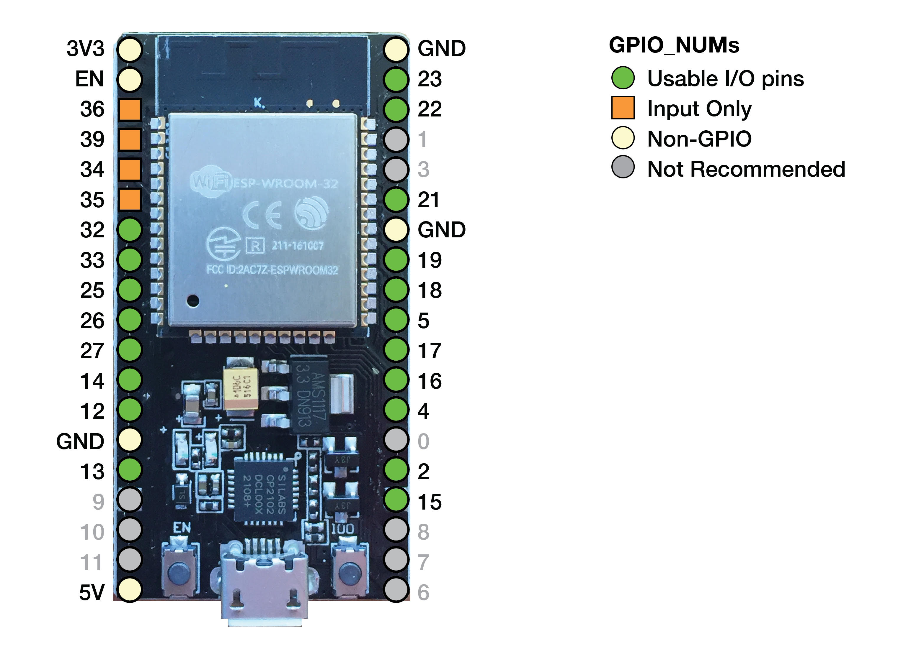
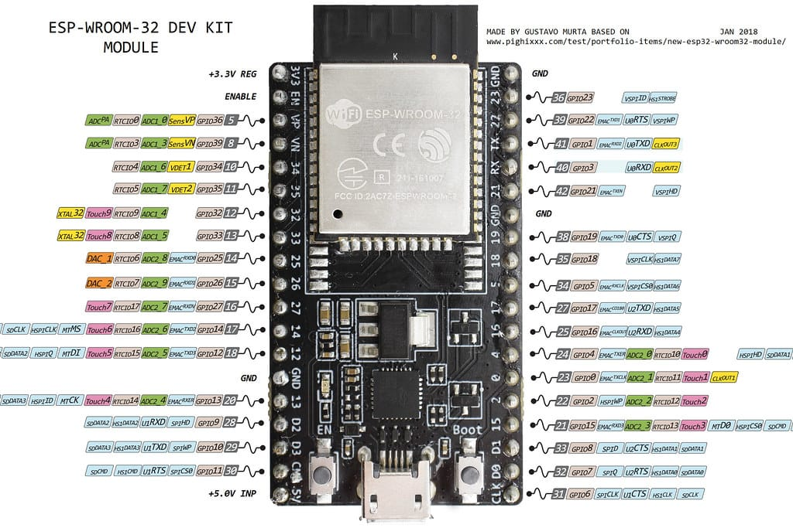

# Usable I/O Pins
<hr/>
<b>esp32_gpio_pin_numbers :---</b>


<hr/>
<b>esp32_gpio_pin_detailes :---<b/>


<hr/>
### GPIO_NUM_0
- This is used for the bootloader (Usable, but for experts only). 
- If it is low on boot, it will enter bootloader mode. 
- It is best if you can guarantee that it is high regardless of the connected item state at boot.
  - For example, if you use it for a limit switch, the switch could force a low state and cause problems.

### GPIO_NUM_2
- Some dev boards have an LED on this.
- It does not work well as an input if this is the case because the LED affects the voltage on the pin.
- It is a strapping pin. It must be either left unconnected/floating or driven Low in order to enter the serial bootloader ([read more](#)).
- It works well as the spindle pin. The LED gives a nice indication of the spindle on and PWM level.

### GPIO_NUM_4

### GPIO_NUM_5

### GPIO_NUM_12
- It is a strapping pin. 
- If driven High, flash voltage (VDD_SDIO) is 1.8V, not the default 3.3V. 
- This pin has an internal pull-down resistor, so unconnected = Low = 3.3V. 
- If driven high, the flash may brownout. If, however, the flash is meant to work at 1.8V, then not driving this pin to High may cause the flash to burn out ([read more](#)).
- Most off-the-shelf controllers (such as the ESP-WROOM-32) work at the default 3.3V.
- You can remove the strapping pin feature by setting the one-time programmable efuse:
  ```bash
  python espefuse.py --port COM4 set_flash_voltage 3.3V
  
- **GPIO_NUM_13**
- **GPIO_NUM_14**  
  *(some pulses at boot)*

- **GPIO_NUM_15**  
  Some pulses at boot.  
  It is a strapping pin. If driven Low, silences boot messages printed by the ROM bootloader.  
  Has an internal pull-up, so unconnected = High = normal output [(read more)](#).

- **GPIO_NUM_16**
- **GPIO_NUM_17**
- **GPIO_NUM_18**
- **GPIO_NUM_19**
- **GPIO_NUM_21**
- **GPIO_NUM_22**
- **GPIO_NUM_23**
- **GPIO_NUM_25**
- **GPIO_NUM_26**
- **GPIO_NUM_27**
- **GPIO_NUM_32**
- **GPIO_NUM_33**  
  Input Only (no pullup/pulldown).  
  If you do not have external pull up or pull down resistors, do not use these pins!  
  We recommend a 5k to 10k resistor. If you don't know how to use pull resistors, google it for some nice pictures and diagrams.

- **GPIO_NUM_34**
- **GPIO_NUM_35**
- **GPIO_NUM_36**
- **GPIO_NUM_37**  
  *(not typically available)*

- **GPIO_NUM_38**  
  *(not typically available)*

- **GPIO_NUM_39**

## Do Not Use (or Not Recommended)

- **GPIO_NUM_1** - Used for USB/Serial Data
- **GPIO_NUM_3** - Used for USB/Serial Data
- **GPIO_NUM_20** - This is not available on ESP32
- **GPIO_NUM_24** - This is not available on ESP32
- **GPIO_NUM_28** - This is not available on ESP32
- **GPIO_NUM_29** - This is not available on ESP32
- **GPIO_NUM_30** - This is not available on ESP32
- **GPIO_NUM_31** - This is not available on ESP32

# Unusable GPIO

- `GPIO_NUM_6` - Use for External Flash
- `GPIO_NUM_7` - Use for External Flash
- `GPIO_NUM_8` - Use for External Flash
- `GPIO_NUM_9` - Use for External Flash
- `GPIO_NUM_10` - Use for External Flash
- `GPIO_NUM_11` - Use for External Flash

# Default Pins

Some pins have default uses in FluidNC. If you are using these functions, it is best to use the default pins. They have been tested a lot, and we know they work.

## I2S

- **bck_pin**: `gpio.22`
- **data_pin**: `gpio.21`
- **ws_pin**: `gpio.17`

## SPI (SD Card, etc)

- **miso_pin**: `gpio.19`
- **mosi_pin**: `gpio.23`
- **sck_pin**: `gpio.18`

## I2C OLED

- **SCL**: `gpio.12`
- **SDA**: `gpio.15`
